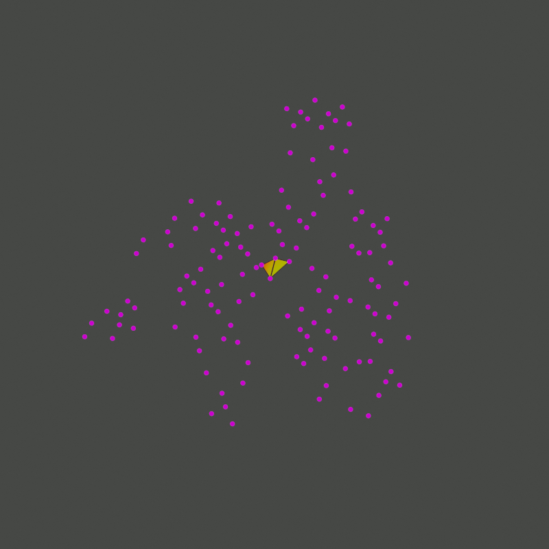
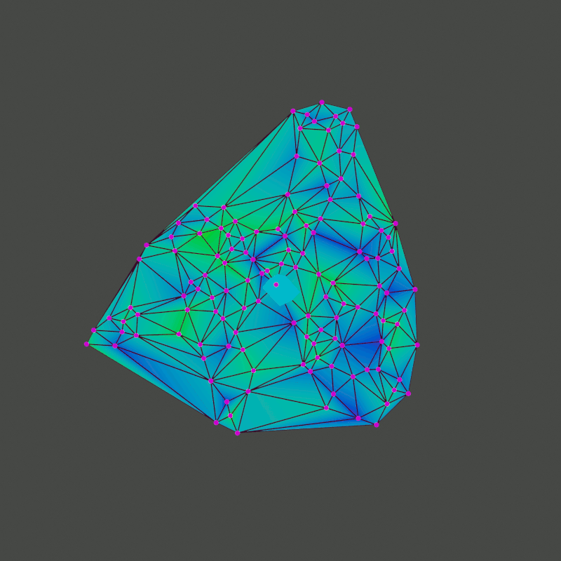

Blender addon for generating Delaunay triangulation and Voronoi meshes.

## Add Voronoi Cells operator

The "Add Voronoi Cells" operator generates a Delaunay triangulation or Voronoi mesh in the active object.

1. Select objects that contain the input points, such as mesh vertices or particles.
1. Select the target object that should contain the output triangulation or cell mesh.

    __Warning__: The active object's mesh data is replaced by the operator.

1. Run the operator from the search menu (F3).

### Input Settings

* _Sources_: Mesh vertices and particles can be used as input points for the triangulation. All selected objects are used as sources, except the active object which is the output target mesh.

    Note that points are projected onto the XY plane for triangulation, the Z component is ignored.
* _Bounds Mode_:
  * _None_: No bounds are applied, point data is used as-is.
  * _Limit_: Bounds min/max values are use to prune the point set, points outside these bounds are ignored.
  * _Repeat_: The point set is repeated in the X and Y direction to create seamlessly tileable patterns.

### Output Settings

* _Output Graph_:
  * _Delaunay_: Creates a Delaunay triangulation of the input points.

    Angles in this triangulation are maximised, skinny triangles are avoided as much as possible.

  * _Voronoi_: Creates Vornoi cells around each input point.

    Each location in the cell is closer to its cell point than any other input point.

* _Output UV Layers_: Selection of data to output as UV layers for use in shaders or modifiers.
  * _Bounds_: Position within the input bounds (Local space coordinates if bounds are disabled)
  * _Circum Circle_: Position within the circumscribed circle of the triangle (Delaunay only)
  * _Cell Centered_: Local space coordinates with cell center at origin (Voronoi only)
  * _Edge Distance_: Local space distance from the cell edge (Voronoi only, needs triangulated cells)
  * _Point Index_: Contiguous index of input point
  * _Point ID_: Unique ID of input point, if available
  * _Random_: Random value based on the id of the input point

* _Triangulate Cells_: If enabled, the Voronoi cells are created using triangle fans instead of ngons.

    This can be useful if the _Edge Distance_ layer is used in shading, which requires the center vertex.

* _Generate Debug Meshes_: Debugging feature which generates intermediate meshes for each step in the algorithm.

    __Warning__: This can generate a lot of data and stall or even crash Blender if too many input points are used (less than 500 is advised). Should not be used in production.

## Triangulator

The triangulator used for generating Delaunay or Voronoi meshes works in several stages:

1. Sweep-Hull triangulation

    

    

    Creates a base non-overlapping triangulation of the XY plane from the input points. Points are first sorted by distance from the center of the point distribution. Then a convex hull is generated by successively adding points.

    Note that the resulting triangulation does not generally satisfy the Delaunay condition yet.
    

1. Edge Flipping

    

    

    In this step the edges of triangles are tested for the Delaunay condition: No other point must lie within the circumcircle of either adjacent triangle. If the Delaunay condition is not satisfied, the edge is "flipped", i.e. it is replaced by the edge between the opposing vertices of the adjacent triangles.

    This procedure ensures the Delaunay condition for the edge in question, but requires re-examining the surrounding edges, leading to a O(n^2) algorithm in the worst case. However, the preceding sweep-hull stage tends to create well-conditioned triangles that lead to O(n*log(n)) runtime.
    

1. Voronoi Cells

    

    

    If the final output type is a Voronoi graph, the triangulation mesh is replaced by its dual graph, constructed from cells around each vertex. The cell boundaries are constructed by connecting the centers of triangle circumcircles. The resulting ngons contain all locations around a point that closest to that point.
    

